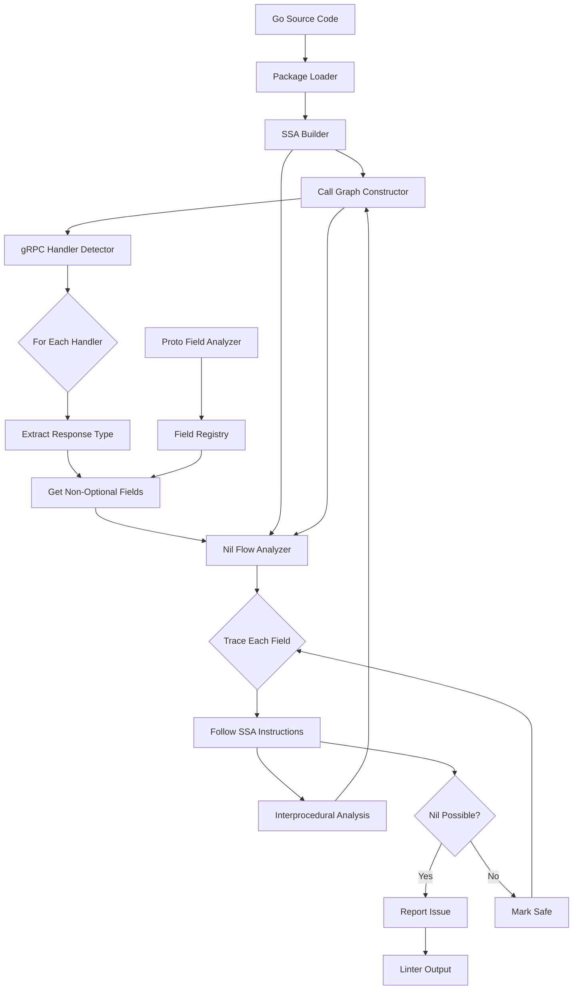
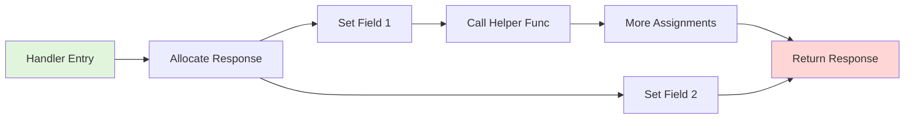
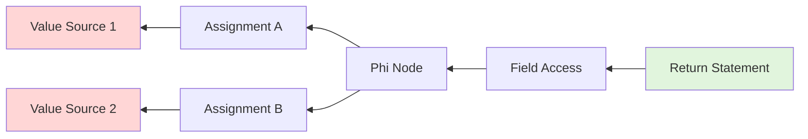

# gRPC Nil-Value Linter Architecture

## Overview

This linter analyzes Go code to detect potential nil pointer dereferences in gRPC endpoint methods. It uses Static Single Assignment (SSA) form analysis to trace data flow through the entire call graph, identifying cases where non-optional proto message fields might be nil.

## Core Components

### 1. Proto Field Analyzer
**Purpose**: Identify which fields in proto-generated structs are non-optional and prone to nil issues.

**Key Responsibilities**:
- Parse Go struct field tags to identify `oneof` fields
- Detect pointer-type fields that represent sub-messages
- Distinguish between scalar types, maps, repeated fields (safe) vs message types (need checking)
- Build a registry of proto message types and their risky fields

**Implementation Strategy**:
```go
type ProtoFieldInfo struct {
    FieldName     string
    IsPointer     bool
    IsMessage     bool
    IsOptional    bool  // has oneof tag
    IsScalar      bool
    IsRepeated    bool
    IsMap         bool
    MessageType   string
}
```

### 2. gRPC Handler Detector
**Purpose**: Identify methods that implement gRPC service handlers.

**Detection Criteria**:
- Methods with signature: `(ctx context.Context, req *XxxRequest) (*XxxResponse, error)`
- Methods whose receiver type implements a gRPC service interface
- Methods that return proto-generated message types

**Implementation Strategy**:
- Use `go/types` to inspect method signatures
- Check if return types are proto-generated (have ProtoMessage methods)
- Optionally match against `*grpc.UnaryServerInfo` patterns

### 3. SSA-Based Nil Flow Analyzer
**Purpose**: Perform deep data flow analysis to detect nil values that could reach response message fields.

**Core Algorithm**:
1. Build SSA representation of the entire program
2. Construct call graph for interprocedural analysis
3. For each gRPC handler, identify the return value
4. Trace backward through SSA instructions to find all assignments to response fields
5. For each field assignment, determine if the value could be nil
6. Follow function calls to analyze field setting in helper functions

**SSA Instructions to Analyze**:
- `*ssa.Alloc`: Track new allocations (non-nil)
- `*ssa.Call`: Follow function calls to analyze returned values
- `*ssa.FieldAddr`: Track field assignments
- `*ssa.Store`: Record what values are stored into fields
- `*ssa.Phi`: Handle control flow merges (may introduce nil)
- `*ssa.MakeInterface`, `*ssa.ChangeInterface`: Track interface conversions
- `*ssa.Const`: Identify nil constants

**Nil Detection Heuristics**:
- Explicit nil constants
- Uninitialized pointer fields (Go zero values)
- Values from functions that may return nil
- Phi nodes where one path could be nil
- Interface conversions with potentially nil values

### 4. Call Graph Traversal
**Purpose**: Enable interprocedural analysis to follow data flow across function boundaries.

**Strategy**:
- Use `golang.org/x/tools/go/callgraph` package
- Build static call graph using RTA (Rapid Type Analysis) or CHA (Class Hierarchy Analysis)
- For each field assignment that calls a function, recursively analyze that function
- Cache results to avoid re-analyzing functions
- Handle recursive calls with bounded depth

### 5. Main Analyzer Integration
**Purpose**: Orchestrate all components and report findings.

**Workflow**:
1. Load Go packages using `golang.org/x/tools/go/packages`
2. Build SSA for all packages
3. Scan for gRPC handler methods
4. For each handler:
   - Extract the response message type
   - Identify non-optional fields using ProtoFieldAnalyzer
   - Trace data flow for each risky field
   - Report if nil is possible
5. Format and output results

## Architecture Diagram



## Data Flow Analysis

### Forward Analysis Flow


### Backward Analysis Flow


## Key Algorithms

### Algorithm 1: Field Risk Classification
```
function classifyField(field *types.Var, structType *types.Struct) -> FieldRisk:
    if field is not pointer type:
        return SAFE  // scalars are safe
    
    if field has "oneof" tag:
        return SAFE  // oneof fields are explicitly optional
    
    fieldType = underlyingType(field.Type())
    
    if isRepeatedOrMap(fieldType):
        return SAFE  // slices and maps are safe when nil
    
    if isProtoMessage(fieldType):
        return RISKY  // sub-messages must not be nil
    
    return SAFE
```

### Algorithm 2: Nil Value Tracing
```
function traceNilPossibility(value ssa.Value, visited Set) -> NilStatus:
    if value in visited:
        return UNKNOWN  // cycle detected
    
    visited.add(value)
    
    switch value.type:
        case *ssa.Const:
            return NIL if value is nil else NOT_NIL
        
        case *ssa.Alloc:
            return NOT_NIL  // new allocation
        
        case *ssa.Call:
            callee = value.callee
            if isBuildInNew(callee):
                return NOT_NIL
            
            // Recursively analyze callee function
            return analyzeFunction(callee, visited)
        
        case *ssa.Phi:
            // Check all incoming edges
            for edge in value.edges:
                if traceNilPossibility(edge, visited) == POSSIBLE_NIL:
                    return POSSIBLE_NIL
            return NOT_NIL
        
        case *ssa.FieldAddr, *ssa.Field:
            // Trace back to the base object
            base = value.base
            return traceNilPossibility(base, visited)
        
        default:
            return UNKNOWN
```

### Algorithm 3: Interprocedural Analysis
```
function analyzeFunction(fn *ssa.Function, context AnalysisContext) -> NilStatus:
    if result in cache[fn]:
        return cache[fn]
    
    if depth > MAX_DEPTH:
        return UNKNOWN
    
    // Find all return statements
    returns = findReturns(fn)
    
    for ret in returns:
        if ret.value != nil:
            status = traceNilPossibility(ret.value, context)
            if status == POSSIBLE_NIL:
                cache[fn] = POSSIBLE_NIL
                return POSSIBLE_NIL
    
    cache[fn] = NOT_NIL
    return NOT_NIL
```

## Implementation Phases

### Phase 1: Foundation (Core Infrastructure)
- Set up Go module and project structure
- Implement package loading and SSA building
- Create basic proto field analyzer
- Write unit tests for field classification

### Phase 2: Handler Detection
- Implement gRPC handler identification logic
- Handle various gRPC patterns (unary, streaming)
- Test with real gRPC service definitions

### Phase 3: SSA Analysis Engine
- Implement nil value tracing for basic cases
- Add support for common SSA instruction types
- Create test cases with known nil/non-nil flows

### Phase 4: Interprocedural Analysis
- Build call graph integration
- Implement function summary caching
- Add recursive call handling

### Phase 5: Integration & Polish
- Connect all components
- Implement reporting and diagnostics
- Add configuration options
- Create CLI tool

### Phase 6: Testing & Documentation
- Comprehensive test suite
- Integration tests with real projects
- Documentation and examples
- Performance optimization

## Technology Stack

**Core Dependencies**:
- `golang.org/x/tools/go/packages` - Package loading
- `golang.org/x/tools/go/ssa` - SSA construction
- `golang.org/x/tools/go/callgraph` - Call graph analysis
- `golang.org/x/tools/go/types` - Type information
- `golang.org/x/tools/go/analysis` - Analyzer framework

**Optional Integrations**:
- `golangci-lint` - Integrate as a custom linter

## Configuration Options

```yaml
# .grpc-nil-linter.yaml
ignore_packages:
  - "test/**"
  - "mock/**"

max_analysis_depth: 10

report_confidence:
  - "definite"  # Only report definite nil issues
  - "probable"  # Report likely nil issues
  - "possible"  # Report any possible nil issues

check_types:
  - "google.protobuf.*"
  - "*.pb.go"  # All proto generated files

exclude_fields:
  - "OptionalField"
  - "Deprecated*"
```

## Error Reporting Format

```
path/to/handler.go:45:2: potential nil dereference in gRPC response
    Handler: UserService.GetUser
    Response: *pb.UserResponse
    Field: Profile.Avatar (non-optional message field)
    Trace: Profile assigned from getUserProfile() which may return nil
    Confidence: High
    Suggestion: Check for nil before assignment or ensure getUserProfile never returns nil
```

## Performance Considerations

1. **Caching**: Cache function analysis results to avoid re-computation
2. **Incremental Analysis**: Only analyze changed files when possible
3. **Parallel Processing**: Analyze multiple handlers concurrently
4. **Depth Limiting**: Bound interprocedural analysis depth
5. **Early Termination**: Stop analysis when definite nil found

## Extension Points

1. **Custom Heuristics**: Enable project-specific nil detection rules
2. **Suppression Comments**: Support `//nolint:grpc-nil` style suppressions

## Success Criteria

- ✓ Detect nil in direct field assignments
- ✓ Detect nil propagated through helper functions
- ✓ Handle control flow (if/else, switch statements, loops)
- ✓ Minimize false positives (< 10% in real codebases)
- ✓ Fast enough for CI usage (< 30s for 100k LOC)
- ✓ Clear, actionable error messages

## References

- [Go SSA Documentation](https://pkg.go.dev/golang.org/x/tools/go/ssa)
- [Go Analysis Framework](https://pkg.go.dev/golang.org/x/tools/go/analysis)
- [gRPC Go Documentation](https://grpc.io/docs/languages/go/)
- [Protocol Buffers](https://protobuf.dev/)